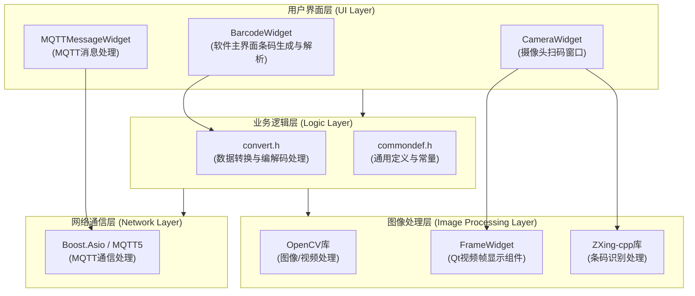

# Lab2QRCode 软件设计文档

## 1. 项目概述

### 1.1 项目简介

Lab2QRCode 是一款跨平台（Windows、Linux）的专业条码处理工具，支持将任意二进制或文本文件转换为多种条码图片，以及将条码图片解码回原始文件。

### 1.2 核心特性

- **双向转换**：文件到条码的编码、条码到文件的解码
- **多格式支持**：支持 19 种标准一维、二维条码格式
- **实时扫描**：摄像头实时扫码识别
- **批量处理**：支持一次性处理多个文件
- **数据完整性**：Base64 编码确保特殊字符正确处理
- **国际化**：支持中文简体和英文界面
- **远程通信**：MQTT 消息订阅和监控

### 1.3 技术栈概览

| 技术类别 | 技术选型 | 版本要求 |
|---------|---------|---------|
| 开发语言 | C++ | C++20 |
| GUI 框架 | Qt | 5.12.12 |
| 条码处理 | zxing-cpp | v2.3.0 |
| 图像处理 | OpenCV | 4.x |
| 网络通信 | Boost.Asio + MQTT5 | Latest |
| 日志系统 | spdlog | v1.16.0 |
| 构建工具 | CMake | 3.10+ |
| 脚本工具 | PowerShell | 7.5+ |

---

## 2. 功能需求

### 2.1 条码生成功能

- **文件输入**
  - 上传普通文本文件生成条码图片
  - 上传二进制文件生成条码图片
  - 手动输入文本生成条码图片
  - 批量生成：支持多选文件批量处理

- **生成配置**
  - 支持 19 种条码格式选择
  - 可配置图片宽度、高度
  - 可调整条码边距（margin）
  - 可选 Base64 编码/解码

### 2.2 条码解析功能

- **图片输入**
  - 上传条码图片文件进行解析
  - 批量解析：支持多选图片文件批量处理
  - 解析结果导出为文本文件或显示在界面上

- **解析特性**
  - 自动尝试所有 19 种条码格式
  - 支持多种图像格式（PNG、JPG、BMP 等）
  - Base64 解码恢复原始数据

### 2.3 摄像头扫码功能

- **实时扫描**
  - 基于 OpenCV、ZXing-cpp 实现摄像头实时扫码
  - 识别到条码自动在视频预览中用绿色方框标记
  - 实时显示解码结果在表格中

- **设备管理**
  - 支持选择不同的摄像头设备
  - 支持配置不同的分辨率（720p、1080p 等）
  - 动态切换摄像头和配置

- **结果导出**
  - 导出扫描结果为 HTML 文件
  - 导出扫描结果为 XLSX 文件
  - 调试模式下保存识别帧到本地

### 2.4 其他功能

- **MQTT 通信**：远程消息订阅和调试监控
- **系统信息显示**：显示操作系统版本、内核版本、架构信息
- **全局字体配置**：通过配置文件自定义软件全局字体
- **国际化支持**：支持中文简体和英文界面动态切换
- **版本信息**：自动生成包含 Git 信息的版本号

### 2.5 支持的条码格式

不管是生成还是解析，软件都支持以下 19 种条码，即 zxing-cpp 所支持的所有条码类型：

| 商品一维码 | 工业一维码 | 二维矩阵 |
|-----------|-----------|---------|
| UPC-A | Code 39 | QR Code |
| UPC-E | Code 93 | Micro QR Code |
| EAN-8 | Code 128 | rMQR Code |
| EAN-13 | Codabar | Aztec |
| DataBar | DataBar Expanded | DataMatrix |
| DataBar Limited | DX Film Edge | PDF417 |
| | ITF | MaxiCode (partial) |

## 技术架构说明

- **界面框架**：基于 Qt 进行界面绘制与用户交互
- **图像与视频处理**：使用 OpenCV 实现图像加载、摄像头捕获与画面标注
- **条码处理引擎**：全部条码的生成与解析均依赖 ZXing-cpp 库实现
- **兼容性与限制**：条码生成与解析的功能边界、识别成功率及支持的数据格式，**均由 ZXing-cpp 库及其所遵循的条码国际标准决定**。

## 软件代码架构

系统采用模块化设计，主要分为以下几个核心模块：



### 核心组件说明

#### 1. 用户界面层

- [BarcodeWidget](../src/BarcodeWidget.h)：
  - 主界面组件，负责条码生成和解析功能的UI交互
- [CameraWidget](../src/CameraWidget.h)：
  - 摄像头扫码功能界面组件，负责视频捕获、实时扫码、参数配置及结果导出
- [MQTTMessageWidget](../src/mqtt/MQTTMessageWidget.h)：
  - MQTT消息处理界面组件，用于远程消息监控

#### 2. 业务逻辑层

- [convert.h](../src/convert.h#L11-L140)：
  - 核心数据转换模块，包含文件编码/解码、图像处理等功能
- [commondef.h](../src/commondef.h)：
  - 通用定义和常量声明

#### 3. 图像处理层

- [FrameWidget](../src/FrameWidget.h)：
  - 专门用于显示视频帧的Qt组件
- [OpenCV](https://github.com/opencv/opencv)：
  - 负责图像加载、保存、摄像头视频流捕获等底层图像处理
- [zxing-cpp](https://github.com/zxing-cpp/zxing-cpp)：
  - 负责条码的生成和识别算法实现

#### 4. 网络通信层

- Boost.Asio/MQTT5：负责MQTT协议通信，实现远程消息订阅和发布功能（详情见 [mqtt文档](./mqtt.md)）

#### 5. 其他组件

- [UiConfig](../src/components/UiConfig.h)：
  - 用于存储和管理软件的字体配置，项目所有字体相关设置应该从 `Ui::getAppFont()` 获取，不应该直接在其他地方硬编码字体
- [message_dialog](../src/components/message_dialog.h)：
  - 用于显示消息对话框的组件，提供统一的消息提示界面
- [about_dialog](../src/about_dialog.h)：
  - 用于显示软件关于信息的对话框，包含版本号、作者及系统环境信息

---

## 3. 数据流设计

### 3.1 条码生成数据流

```txt
文件选择 → 读取文件内容 → Base64编码（可选）
    ↓
转换为字符串 → ZXing-cpp编码 → 生成BitMatrix
    ↓
转换为QImage → UI显示 → 保存为PNG文件
```

**详细流程：**

1. 用户通过 `QFileDialog` 选择文件或直接输入文本
2. `BarcodeWidget::onGenerateClicked()` 处理生成请求
3. 读取文件内容到 `QByteArray`
4. 如果启用 Base64，使用 `SimpleBase64.h` 进行编码
5. 调用 `convert::byte_to_QRCode_qimage()` 生成条码
6. 使用 `ZXing::MultiFormatWriter` 创建 `BitMatrix`
7. 转换 `BitMatrix` 为 `QImage` 并显示
8. 用户可选择保存生成的条码图片

### 3.2 条码解析数据流

```txt
图片选择 → 读取图片 → OpenCV转换为灰度图
    ↓
ZXing-cpp识别 → 获取文本内容 → Base64解码（可选）
    ↓
显示/保存结果 → 导出为文件
```

**详细流程：**

1. 用户通过 `QFileDialog` 选择条码图片
2. `BarcodeWidget::onDecodeToChemFileClicked()` 处理解码请求
3. 使用 OpenCV `cv::imread()` 读取图片
4. `cv::cvtColor()` 转换为灰度图
5. 创建 `ZXing::ImageView` 并调用 `ZXing::ReadBarcode()`
6. 如果启用 Base64，使用 `SimpleBase64.h` 进行解码
7. 显示解码结果或保存为文件

### 3.3 摄像头扫码数据流

```txt
打开摄像头 → 独立线程捕获帧 → 图像预处理
    ↓                                ↓
条码识别 ← 去重处理 ← 图像增强（可选）
    ↓
绘制标记框 → UI线程更新显示 → 结果表格
```

**详细流程：**

1. `CameraWidget::startCamera()` 初始化摄像头
2. 使用 `cv::VideoCapture` 打开指定设备
3. 启动独立线程 `captureThread` 执行 `captureLoop()`
4. 循环捕获视频帧 `capture->read(frame)`
5. 可选图像增强：直方图均衡化
6. `processFrame()` 调用 ZXing-cpp 识别条码
7. 识别成功后绘制绿色方框标记
8. 通过 Qt 信号发送到 UI 线程更新显示
9. 去重处理：与上一次结果比较，避免重复添加
10. 结果添加到 `QTableView` 中显示

### 3.4 MQTT 消息流

```txt
配置加载 → 创建MqttSubscriber → 连接Broker
    ↓
异步订阅Topic → 接收消息 → 回调函数
    ↓
Qt信号发送 → MQTTMessageWidget显示
```

**详细流程：**

1. 从 `config.json` 加载 MQTT 配置
2. 创建 `MqttSubscriber` 实例，使用 Boost.Asio
3. 在独立线程中运行 `io_context`
4. 连接到 MQTT Broker 并订阅指定 Topic
5. 接收到消息时触发回调函数
6. 通过 Qt 信号 `mqttMessageReceived` 发送到 UI 线程
7. `MQTTMessageWidget` 显示消息内容

---

## 4. 核心类设计

### 4.1 BarcodeWidget（主窗口类）

**职责：** 条码生成和解析的主界面，负责用户交互、文件选择、参数配置

**关键成员变量：**

```cpp
QLineEdit *filePathEdit;                    // 文件路径输入框
QComboBox *formatComboBox;                  // 条码格式选择
QLineEdit *widthInput, *heightInput;        // 宽高输入
QProgressBar *progressBar;                  // 批处理进度条
std::vector<result_data_entry> lastResults; // 上次处理结果
CameraWidget preview;                       // 摄像头窗口
std::unique_ptr<MqttSubscriber> subscriber_; // MQTT订阅者
```

**关键方法：**

```cpp
void onGenerateClicked();             // 生成条码（支持批处理）
void onDecodeToChemFileClicked();     // 解码条码（支持批处理）
void onSaveClicked();                 // 保存条码图片
void onBatchFinish(...);              // 批处理完成回调
void retranslate();                   // 语言切换刷新UI
```

**设计要点：**

- 使用 `QFutureWatcher` 实现异步批处理，避免界面卡顿
- 通过 Qt 信号槽连接 MQTT 消息接收
- 支持多文件选择和批量处理
- 动态更新进度条显示处理进度

### 4.2 CameraWidget（摄像头窗口类）

**职责：** 实时视频捕获、条码识别、结果显示和导出

**关键成员变量：**

```cpp
cv::VideoCapture *capture;            // 摄像头捕获对象
std::atomic_bool running;             // 控制捕获循环
std::thread captureThread;            // 捕获线程
FrameWidget *frameWidget;             // 视频帧显示组件
QTableView *resultDisplay;            // 结果表格
QStandardItemModel *resultModel;      // 表格数据模型
int currentCameraIndex;               // 当前摄像头索引
bool isEnhanceEnabled;                // 是否启用图像增强
bool isDebugMode;                     // 调试模式（保存帧）
```

**关键方法：**

```cpp
void startCamera(int camIndex);       // 启动摄像头
void stopCamera();                    // 停止摄像头
void captureLoop();                   // 捕获循环（独立线程）
void processFrame(...);               // 处理帧并识别条码
void updateFrame(...);                // 更新UI显示
bool exportResultsToHtml(...);        // 导出HTML
bool exportResultsToXlsx(...);        // 导出XLSX
```

**设计要点：**

- 使用独立线程进行视频捕获，避免阻塞 UI 线程
- 使用原子变量 `running` 控制线程安全退出
- 窗口隐藏时自动停止摄像头，显示时自动启动
- 去重机制：静态变量记录上次扫码结果，避免重复添加
- 可选图像增强：使用直方图均衡化提高识别率

### 4.3 convert 命名空间（核心转换逻辑）

**职责：** 提供文件与条码之间的转换功能

**核心数据结构：**

```cpp
struct result_data_entry {
    QString source_file_name;
    std::variant<std::monostate, QImage, QByteArray, std::string> data;
    // 可能是空、QRCode图片、解码数据、错误信息
};

struct QRcode_create_config {
    int target_width = 300;
    int target_height = 300;
    ZXing::BarcodeFormat format = ZXing::BarcodeFormat::QRCode;
    int margin = 1;
};
```

**核心函数：**

```cpp
QImage byte_to_QRCode_qimage(const std::string &text,
                              const QRcode_create_config config);
// 将文本数据转换为条码图片

result_i2t QRcode_to_byte(const std::string &file_path);
// 从条码图片解码出文本数据
```

**设计要点：**

- 使用 `std::variant` 实现类型安全的多态返回值
- 支持错误信息传递和状态检查
- 配置参数封装为结构体，便于扩展
- Header-only 设计，编译时优化

### 4.4 LanguageManager（语言管理器）

**职责：** 单例模式管理应用程序的多语言切换

**关键成员变量：**

```cpp
QTranslator translator_;              // Qt翻译器
QString currentLocale_;               // 当前语言代码
QMap<QString, QString> languageNames_;// 语言名称映射
```

**关键方法：**

```cpp
static LanguageManager& instance();   // 获取单例
void init(QString locale = {});       // 初始化语言
void switchLanguage(const QString &locale); // 切换语言
QString currentLocale() const;        // 获取当前语言
QStringList availableDisplayNames();  // 可用语言列表
```

**设计要点：**

- 单例模式确保全局唯一
- 从配置文件读取上次选择的语言
- 切换语言时自动刷新所有窗口（通过 `QEvent::LanguageChange`）
- 支持的语言：zh_CN（中文简体）、en_US（英文）

### 4.5 MqttSubscriber（MQTT客户端）

**职责：** 连接 MQTT Broker 并订阅消息

**关键成员变量：**

```cpp
std::unique_ptr<boost::asio::io_context> ioc_;
mqtt_client<tcp::socket> client_;     // MQTT客户端
MessageCallback callback_;            // 消息回调函数
std::thread runner_thread_;           // IO线程
```

**关键方法：**

```cpp
MqttSubscriber(const std::string &host,
               uint16_t port,
               const std::string &client_id,
               const MessageCallback &callback);
void subscribe(const std::string &topic); // 订阅主题
void stop();                          // 停止连接
```

**设计要点：**

- 使用 Boost.Asio 实现异步网络 I/O
- 使用 `executor_work_guard` 防止 `io_context` 提前退出
- 独立线程运行 `io_context.run()`
- 支持从配置文件加载连接参数
- 自动生成唯一的 client_id（基于随机数）

---

## 5. 配置管理

### 5.1 配置文件结构

**位置：** `setting/config.json`

```json
{
    "mqtt": {
        "host": "127.0.0.1",
        "port": 1883,
        "client_id": "123"
    },
    "ui": {
        "font_file": "",
        "font_family": "",
        "bold": false
    },
    "language": "zh_CN"
}
```

### 5.2 配置加载机制

**MQTT 配置加载：**

```cpp
MqttConfig MqttSubscriber::loadMqttConfig(const std::string &filename);
```

- 使用 `nlohmann::json` 解析配置文件
- 加载 host、port、client_id

**UI 配置加载：**

```cpp
UiConfig Ui::loadUiConfig(const std::string &filename);
void Ui::applyFont(QApplication &app, const Ui &ui);
```

- 支持自定义字体文件路径
- 支持字体族名称和粗体设置
- 在 `main()` 函数中应用全局字体

**语言配置加载：**

```cpp
void LanguageManager::init(QString locale);
```

- 如果参数为空，从配置文件读取
- 如果配置文件中无设置，使用系统默认语言

---

## 6. 国际化设计

### 6.1 翻译系统架构

**工具链：** Qt Linguist (lupdate + lrelease)

**翻译文件：**

- `translations/app_zh_CN.ts` - 中文简体翻译源文件
- `translations/app_en_US.ts` - 英文翻译源文件
- `translations/app_*.qm` - 编译后的翻译文件（运行时加载）

### 6.2 自动化流程

**CMake 集成：**

```cmake
# 每次构建都自动更新 .ts 文件
add_custom_target(update_translations ALL
    COMMAND ${Qt5_LUPDATE_EXECUTABLE}
            ${CMAKE_CURRENT_SOURCE_DIR}/src
            -ts ${TS_FILES}
            -no-obsolete
)

# 生成 .qm 文件
qt5_add_translation(QM_FILES ${TS_FILES})

# 拷贝到 bin/translations 目录
add_custom_command(TARGET Lab2QRCode POST_BUILD
    COMMAND ${CMAKE_COMMAND} -E copy_if_different
            ${QM_FILES} $<TARGET_FILE_DIR:Lab2QRCode>/translations/
)
```

### 6.3 代码中的翻译

**使用宏进行标记：**

```cpp
// UI文本使用 tr() 宏
generateButton->setText(tr("Generate"));
menuBar->addMenu(tr("&Help"));

// 消息提示使用 tr()
MessageDialog::information(this, tr("Success"),
                          tr("Barcode generated successfully!"));
```

**动态语言切换：**

```cpp
void BarcodeWidget::changeEvent(QEvent *event) {
    if (event->type() == QEvent::LanguageChange) {
        retranslate();  // 刷新所有UI文本
    }
}
```

---

## 7. 版本管理与构建

### 7.1 版本信息生成

**自动化脚本：** `scripts/build/version_info.ps1`

**生成内容：**

```cpp
// src/version_info/version.cpp (自动生成)
constexpr std::string_view GIT_HASH = "e7eb833";
constexpr std::string_view GIT_TAG = "v1.0.0";
constexpr std::string_view GIT_BRANCH = "master";
constexpr std::string_view COMMIT_TIME = "2025-01-04 10:30:00";
constexpr std::string_view BUILD_TIME = "2025-01-04 15:45:30";
constexpr std::string_view BUILD_SYSTEM = "Windows 11 x64";
```

### 7.2 构建系统

**CMake 配置要点：**

- 最低版本：3.10
- C++ 标准：C++20
- 支持工具链：MSVC、GCC、Clang
- 预设配置：`CMakePresets.json` 提供常用配置

**依赖查找顺序：**

1. Qt5（必需）：Core、Widgets、Concurrent、Multimedia、MultimediaWidgets
2. ZXing-cpp（必需）：v2.3.0，通过 `find_package(ZXing REQUIRED)`
3. OpenCV（必需）：4.x，通过 `find_package(OpenCV REQUIRED)`
4. Boost（必需）：system、random，头文件模式的 MQTT5
5. spdlog（可选）：Header-only 模式，未找到时使用 include/ 目录
6. xlsxwriter（必需）：用于导出 XLSX 文件

**输出目录结构：**

```txt
build/
└── Release/
    └── bin/
        ├── Lab2QRCode.exe (或 Lab2QRCode)
        ├── translations/
        │   ├── app_zh_CN.qm
        │   └── app_en_US.qm
        └── setting/
            └── config.json
```

### 7.3 CI/CD 流程

**平台支持：** Windows 2025、Ubuntu 24.04

**Windows 流程：**

1. 代码格式检查（clang-format-22）
2. 安装依赖（Qt、Boost、OpenCV、zxing-cpp、spdlog、xlsxwriter）
3. CMake 配置和构建
4. windeployqt 打包依赖 DLL
5. 压缩为 ZIP 发布包
6. 上传到 GitHub Releases（tag 触发）

**Linux 流程：**

1. 代码格式检查
2. apt 安装依赖
3. 从源码编译 zxing-cpp
4. CMake 配置和构建
5. LinuxDeploy 生成 AppImage
6. 上传到 GitHub Releases

---

## 8. 性能优化

### 8.1 异步处理

**批量文件处理：**

- 使用 `QFuture` 和 `QFutureWatcher` 实现异步处理
- 避免界面冻结，提供进度反馈
- 多核并行处理多个文件

**摄像头捕获：**

- 独立线程执行视频捕获循环
- 使用原子变量控制线程安全
- UI 线程仅负责显示更新

**MQTT 通信：**

- Boost.Asio 异步 I/O
- 独立线程运行 `io_context`
- 回调函数通过 Qt 信号传递到 UI 线程

### 8.2 内存管理

- 使用智能指针管理动态分配的资源
- OpenCV `Mat` 和 Qt `QImage` 的高效转换
- 大文件处理时的内存复用

### 8.3 识别优化

**图像预处理：**

- 灰度转换减少计算量
- 可选直方图均衡化提高识别率
- 适当的图像分辨率平衡速度和准确性

**去重机制：**

- 静态变量记录上次识别结果
- 避免短时间内重复添加相同条码

---

## 9. 安全性考虑

### 9.1 数据完整性

**Base64 编码：**

- 防止特殊字符（控制字符、Unicode）导致的数据损坏
- 确保二进制数据正确嵌入条码
- 用户可选启用/禁用

### 9.2 输入验证

- 文件路径合法性检查
- 图片格式验证
- 条码解析失败时的错误处理

### 9.3 网络安全

**MQTT 连接：**

- 默认使用本地 Broker（127.0.0.1）
- 用户配置外部 Broker 时需自行确保安全性
- 建议使用 TLS 加密连接（需 Broker 支持）

---

## 10. 扩展性设计

### 10.1 条码格式扩展

- 条码格式完全由 ZXing-cpp 库决定
- 升级 ZXing-cpp 版本即可支持新格式
- UI 中的格式列表自动从枚举生成

### 10.2 语言扩展

**添加新语言步骤：**

1. 在 `translations/` 目录创建新的 `.ts` 文件
2. 在 `CMakeLists.txt` 中添加到 `TS_FILES` 列表
3. 在 `LanguageManager` 中注册新语言
4. 运行 `lupdate` 提取翻译字符串
5. 翻译 `.ts` 文件并运行 `lrelease`

### 10.3 导出格式扩展

当前支持：HTML、XLSX

**扩展步骤：**

1. 在 `CameraWidget` 中添加新的导出方法
2. 实现数据序列化逻辑
3. 在菜单中添加新的导出选项

---

## 11. 已知限制

1. **条码容量限制**：由 ZXing-cpp 和各条码标准决定，不同格式容量不同
2. **摄像头兼容性**：依赖 OpenCV 的摄像头支持，部分特殊设备可能不兼容
3. **MQTT 协议版本**：当前使用 MQTT5，不兼容 MQTT3.1.1 Broker
4. **图像增强**：当前仅支持直方图均衡化，复杂光照条件可能需要更高级算法
5. **跨平台字体**：自定义字体在不同平台的渲染可能有差异

---

## 12. 未来规划

1. 支持更多导出格式（PDF、CSV 等）
2. 增加条码批量打印功能
3. 支持 MQTT TLS 加密连接
4. 增加更多图像预处理选项
5. 支持二维码中的 Logo 嵌入
6. 增加条码识别历史记录功能
7. 支持更多语言（日语、韩语等）

---

## 附录

### A. 参考文档

- [Qt 5.12 官方文档](https://doc.qt.io/archives/qt-5.12/)
- [ZXing-cpp GitHub](https://github.com/zxing-cpp/zxing-cpp)
- [OpenCV 4 文档](https://docs.opencv.org/4.x/)
- [Boost.Asio 文档](https://www.boost.org/doc/libs/master/doc/html/boost_asio.html)
- [MQTT 5.0 规范](https://docs.oasis-open.org/mqtt/mqtt/v5.0/mqtt-v5.0.html)

### B. 开发工具

- Visual Studio 2022 (Windows)
- GCC 11+ / Clang 14+ (Linux)
- CMake 3.10+
- PowerShell 7.5+
- clang-format-22（代码格式化）

### C. 测试平台

- Windows 10/11 (x64)
- Ubuntu 22.04/24.04 LTS
- Debian 12/13
- Arch Linux
